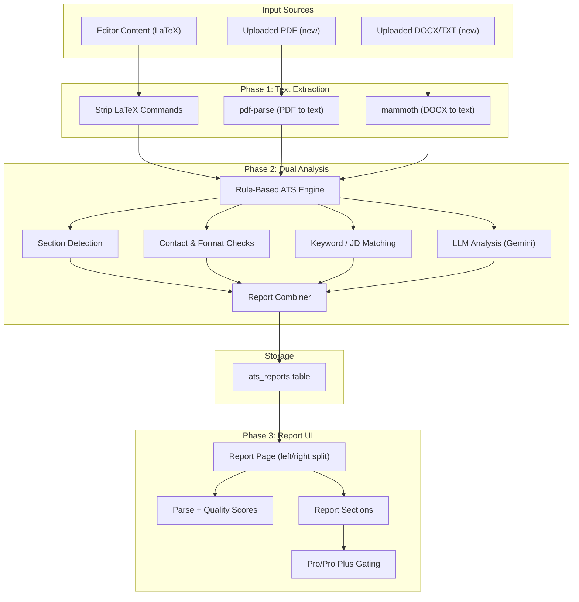

# ATS Resume Scoring System

## Current State

- LaTeX content is stored as plain text in `projects.content` (no file uploads).
- PDFs are generated on-the-fly via `pdflatex`/`xelatex`/`lualatex`, returned as base64 data URLs, and not persisted.
- AI uses Gemini 2.5 Flash via `src/services/ai-service.ts`.
- Plans: `free`, `pro`, `pro_plus` -- but only project limits are enforced; no feature gating on AI or templates yet.
- No file upload infrastructure exists anywhere in the app.

## Analysis Approach: Two Methods (Like Real ATS)

Real-world ATS systems use **deterministic parsing and keyword matching** first, then sometimes **ML/NLP** for ranking or nuance. We mirror this with:

1. **Rule-based / keyword parsing** — How companies actually parse resumes:
  - Section detection (Experience, Education, Skills, Projects, Contact).
  - Required contact fields (name, email, phone; optional LinkedIn, GitHub).
  - Keyword extraction from resume and from job description; exact and normalized matching.
  - Date format detection and consistency.
  - Length and structure checks (no images/tables in plain text, bullet density).
  - Deterministic, fast, transparent, and no LLM cost for this path.
2. **LLM analysis** — Qualitative layer on top:
  - Summary and “readability”/impact assessment.
  - Actionable suggestions (wording, stronger verbs, measurable outcomes).
  - Does not replace rule-based; it adds narrative and improvement ideas.

The **final report combines both**: an “ATS Parse Score” (rule-based) and a “Quality Score” (LLM), with merged sections and suggestions. Gating (free vs pro) still applies to which parts of the combined report are visible.

**What real ATS systems do (we mirror in rule-based engine):**

- **Section parsing:** Detect Experience, Education, Skills, etc. by heading keywords; many ATS use regex or simple NLP to chunk the resume.
- **Required fields:** Extract and validate email, phone, name; optional links (LinkedIn, GitHub). Missing fields often cause instant rejection.
- **Keyword matching:** Extract terms from the job description; match against resume text (exact or normalized). Score = % of JD keywords found. This is the main "ATS pass" criterion at many companies.
- **Format checks:** Length, bullet usage, date formats, and avoidance of complex tables/graphics in plain-text parse. ATS often fail on heavy formatting.
- **No LLM required for pass/fail:** The initial screen is usually deterministic (keyword + section + contact). LLM adds value for *why* and *how to improve*, not for the core parse.

## Architecture Overview




---

## Phase 1: Text Extraction and File Upload

**Goal:** Enable the ATS system to accept resume content from multiple sources -- the editor, uploaded PDFs, and uploaded DOCX/TXT files.

### 1A. LaTeX-to-plain-text extractor

Create `src/services/ats/text-extractor.ts`:

- Strip LaTeX commands (`\begin`, `\end`, `\textbf`, `\section`, etc.) to extract raw text content.
- Use regex-based stripping (lightweight, no external deps). This is fast and good enough for resume content.
- Preserve section structure (identify `\section{}`, `\subsection{}` etc.) as metadata for the AI prompt.

### 1B. PDF text extraction

- Install `pdf-parse` (npm package, no native deps).
- Add a new API route `POST /api/ats/upload` that accepts `multipart/form-data` with a PDF/DOCX file.
- Extract text from PDF using `pdf-parse`.
- Max file size: 5MB (enforced in the route).

### 1C. DOCX text extraction

- Install `mammoth` for DOCX-to-text.
- Same upload route handles DOCX based on MIME type.
- Plain text files (.txt) are read directly.

### 1D. Database: ATS reports table

Add to [src/lib/db/schema.ts](src/lib/db/schema.ts):

```ts
export const atsReports = pgTable("ats_reports", {
  id: uuid("id").primaryKey().defaultRandom(),
  userId: text("user_id").references(() => users.id, { onDelete: "cascade" }),
  projectId: uuid("project_id").references(() => projects.id, { onDelete: "set null" }),
  source: text("source").notNull(), // "editor" | "upload_pdf" | "upload_docx" | "upload_txt"
  resumeText: text("resume_text").notNull(),
  score: integer("score").notNull(),              // combined or primary display score
  parseScore: integer("parse_score").notNull(),  // rule-based ATS parse score 0-100
  qualityScore: integer("quality_score").notNull(), // LLM quality score 0-100
  report: text("report").notNull(),              // JSON string of full combined report
  jobDescription: text("job_description"), // optional JD for targeted scoring
  createdAt: timestamp("created_at").notNull().defaultNow(),
});
```

### 1E. Middleware update

Add `/api/ats/upload` to the public or protected routes as needed in [src/middleware.ts](src/middleware.ts). The upload route should require auth. The report viewing page `/ats(.*)` needs auth too (already covered since it's not in the public list).

### Files to create/modify:

- **Create:** `src/services/ats/text-extractor.ts`
- **Create:** `src/app/api/ats/upload/route.ts`
- **Modify:** `src/lib/db/schema.ts` (add `atsReports`)
- **Modify:** `package.json` (add `pdf-parse`, `mammoth`)

---

## Phase 2: Rule-Based ATS Engine + LLM Analysis (Dual-Method)

**Goal:** Run two analyses in parallel—rule-based (real ATS behavior) and LLM (quality/suggestions)—then merge into one report with combined scores and gated sections.

### 2A. Rule-based ATS engine (real-world behavior)

Create `src/services/ats/rule-based-ats.ts`. This engine does **no LLM calls**; it uses regex, keyword lists, and heuristics only.

**Section detection**

- Scan plain text for common headings (case-insensitive, allow minor variations): Experience, Work Experience, Employment; Education; Skills, Technical Skills; Projects; Summary, Objective; Contact, Contact Information.
- Map each line/block to a section; compute section presence and approximate word count per section.
- Output: `{ sections: { name, present, wordCount }, missingSections: string[] }`.

**Contact and required fields**

- **Email:** regex for `*@*.`*.
- **Phone:** regex for digit sequences with optional spaces/dashes/dots/parentheses (international formats).
- **Name:** assume first line or first non-empty block before contact block is name (heuristic).
- **LinkedIn / GitHub / portfolio:** regex or substring match for "linkedin.com", "github.com", "portfolio", etc.
- Score: e.g. 25 points per present field (email, phone, name = 75 max), optional fields add bonus. Output findings like "Missing: phone", "LinkedIn found".

**Keyword extraction and JD matching**

- **From resume:** extract words from skills/experience sections (skip stopwords, normalize case). Optionally use a curated list of "resume power words" and tech terms to detect presence.
- **From job description (if provided):** extract notable terms (n-grams, single words, skip common words). Normalize (lowercase, strip punctuation) for matching.
- **Matching:** exact match and stemmed/simple variant match (e.g. "engineer" vs "engineering") of JD keywords against resume text. Compute: `found: string[]`, `missing: string[]`, and a **keyword match score** (e.g. percentage of JD keywords found).
- This block is **pro-gated** in the UI (keyword list and JD match details).

**Formatting and structure checks**

- **Length:** total word count; flag if too short (< 200) or too long (> 800) for a typical 1-pager.
- **Bullets/lists:** count lines that look like bullets (start with `-`, `*`, `•`, or numbers). Low bullet density may reduce "structure" score.
- **Dates:** regex for month/year (e.g. "Jan 2020", "2020-2022"). Check for consistency (e.g. reverse chronological). Flag if no dates in Experience.
- **Special characters / tables:** in plain-text extraction, complex tables may become garbled; flag "possible table detected" if many aligned spaces or repeated pipes. No images in text—implicitly "clean" for ATS from a parsing perspective.

**Parse score (0–100)**

- Combine section presence, contact completeness, length appropriateness, structure, and (if JD provided) keyword match into a single **ATS Parse Score**. Weights are configurable (e.g. 25% contact, 25% sections, 20% keyword match, 15% length/structure, 15% dates). Output: `parseScore`, and per-category breakdown for the report.

**Output type (rule-based only)**

```ts
type RuleBasedResult = {
  parseScore: number;           // 0-100
  sections: { name: string; present: boolean; wordCount: number }[];
  missingSections: string[];
  contact: { email: boolean; phone: boolean; name: boolean; linkedin?: boolean; github?: boolean };
  contactFindings: string[];
  keywordMatch?: { score: number; found: string[]; missing: string[] };  // when JD provided
  formatFindings: string[];     // length, bullets, dates, tables
  tier: "free" | "pro";         // keyword details = pro
};
```

### 2B. LLM analysis (qualitative layer)

Create `src/services/ats/llm-ats-service.ts` (or keep as a second part of `ats-service.ts`).

- **Input:** same plain text + optional JD.
- **Prompt:** Ask Gemini to act as a resume reviewer (not as the only scorer). Request:
  - A short **summary** (2–3 sentences) and a **quality score** (0–100) based on clarity, impact, and use of action verbs/quantified outcomes.
  - A list of **suggestions** (prioritized: high/medium/low), each with clear text (e.g. "Add a measurable outcome to the first bullet under Experience").
- **Output:** Strict JSON, e.g. `{ qualityScore, summary, suggestions: [{ text, priority }] }`. No duplicate of rule-based section/contact/keyword logic—LLM focuses on **quality and suggestions**.

### 2C. Report combiner

Create `src/services/ats/ats-report-combiner.ts` (or equivalent in `ats-service.ts`).

- Run **rule-based engine** and **LLM analysis** (LLM can be async; rule-based is sync).
- **Combined score:** e.g. 60% parse score + 40% quality score, or show both scores separately in the UI (recommended: "ATS Parse: 72" and "Quality: 65").
- **Sections in report:**
  - Contact & required fields → from rule-based (findings + score).
  - Section presence → from rule-based.
  - Keyword / JD match → from rule-based (pro-gated).
  - Format & structure → from rule-based.
  - Summary → from LLM.
  - Suggestions → merge: rule-based can add suggestions like "Add phone number", "Add Experience section"; LLM adds qualitative ones. Sort by priority, apply tier (first 3 free, rest pro).
- **Final report type** (same as before, but populated from both engines):

```ts
type ATSReport = {
  parseScore: number;            // from rule-based
  qualityScore: number;          // from LLM
  combinedScore: number;        // weighted combination for single gauge if desired
  summary: string;               // from LLM
  sections: ATSSection[];        // from rule-based + any LLM section comments
  keywords?: KeywordAnalysis;    // from rule-based (pro)
  suggestions: ATSSuggestion[];  // merged, with tier
};
```

### 2D. ATS analysis API route

Create `POST /api/ats/analyze`:

- Body: `{ source: "editor" | "upload", projectId?: string, text?: string, jobDescription?: string }`.
- If `source === "editor"`, fetch `projects.content` by `projectId`, extract text via LaTeX stripper.
- If `source === "upload"`, use provided `text`.
- Call **rule-based engine** (sync), then **LLM service** (async). Combine results, then store in `ats_reports` and return report.
- **Rate limiting:** free = 3 scans/day (e.g. track in `user_usage` or new column); pro/pro_plus = unlimited.

### 2E. Database

Store in `ats_reports` the **combined** report JSON (with `parseScore`, `qualityScore`, `combinedScore`, `sections`, `keywords`, `suggestions`, etc.). Optionally store `resumeText` and `jobDescription` for re-runs or debugging.

### Files to create/modify

- **Create:** `src/services/ats/rule-based-ats.ts` (section detection, contact check, keyword/JD matching, format checks, parse score).
- **Create:** `src/services/ats/llm-ats-service.ts` (Gemini prompt, quality score, summary, suggestions).
- **Create:** `src/services/ats/ats-report-combiner.ts` or merge into `src/services/ats/ats-service.ts` (orchestration + combine).
- **Create:** `src/app/api/ats/analyze/route.ts`.
- **Create:** `src/repositories/ats-repository.ts`.
- **Modify:** `src/lib/db/schema.ts` (ensure `ats_reports` has fields for both scores and full report JSON).

---

## Phase 3: ATS Report UI and Plan Gating

**Goal:** Build the interactive report page with left panel (report) and right panel (resume preview), and gate premium insights behind paid plans.

### 3A. Report page layout (`/ats/[id]`)

Two-panel layout using `react-resizable-panels` (already installed):

- **Left panel:** Report content. **Two scores** (or one combined):
  - **ATS Parse Score** (0–100) — from rule-based engine; primary gauge companies care about.
  - **Quality Score** (0–100) — from LLM. Optionally show a **combined** gauge (e.g. 60% parse + 40% quality) for the main "score slider."
- **Right panel:** Resume preview (PDF iframe or formatted text).

Layout sketch:

```
+---------------------------+--------------------+
|  LEFT PANEL (55%)         |  RIGHT PANEL (45%) |
|                           |                    |
|  ATS Parse Score (0-100)  |  Resume Preview    |
|  Quality Score (0-100)    |  (PDF iframe or    |
|  [or combined gauge]      |   formatted text)  |
|  color-coded              |                    |
|                           |                    |
|  Summary (LLM)            |                    |
|                           |                    |
|  Sections (rule-based +  |                    |
|   any LLM notes):         |                    |
|  - Contact    [FREE]      |                    |
|  - Experience [FREE]      |                    |
|  - Skills     [FREE]     |                    |
|  - Keywords/JD [PRO]      |                    |
|  - Format     [FREE]      |                    |
|                           |                    |
|  Suggestions (merged):    |                    |
|  - First 3    [FREE]      |                    |
|  - Rest       [PRO]      |                    |
|                           |                    |
|  [Upgrade to unlock]      |                    |
|  [Edit in TeXel editor]   |                    |
+---------------------------+--------------------+
```

### 3B. Score slider component

Create `src/components/ats/ScoreSlider.tsx`:

- Prefer **two gauges**: "ATS Parse" (rule-based) and "Quality" (LLM). Both 0–100, color-coded (e.g. red / yellow / green).
- Optional: a single **combined** gauge (e.g. 60% parse + 40% quality) for the main CTA.
- Use CSS transitions or Framer Motion (already installed).

### 3C. Report sections with gating

Create `src/components/ats/ReportSection.tsx`:

- Renders section findings for `tier: "free"` sections normally.
- For `tier: "pro"` sections, shows a blurred/locked overlay with "Upgrade to Pro to unlock" CTA linking to `/billing`.
- Same pattern for suggestions: first 3 visible, rest locked.
- Same for keyword analysis: locked behind Pro.

### 3D. "Edit in TeXel" CTA

- If the report was generated from an editor project (`projectId` exists): button links to `/project/[projectId]`.
- If from an upload: button links to `/dashboard` with a prompt to create a new project and paste the suggestions.
- This is the core conversion funnel: **low score -> see suggestions -> "fix it in our editor" -> needs Pro for full suggestions -> upgrade**.

### 3E. ATS entry page (`/ats`)

Create `src/app/(dashboard)/ats/page.tsx`:

- Two options: "Scan from your project" (dropdown of user's projects) or "Upload a resume" (file picker for PDF/DOCX/TXT).
- Optional: paste a job description for targeted scoring.
- "Analyze" button triggers the flow.
- Past reports list (from `ats_reports` for the user).

### 3F. Navigation

- Add "ATS Score" link to the dashboard navbar (in `DashboardNav` rightContent on the dashboard page).
- Add "Check ATS Score" button in the project editor header.

### Files to create/modify:

- **Create:** `src/app/(dashboard)/ats/page.tsx`
- **Create:** `src/app/(dashboard)/ats/[id]/page.tsx`
- **Create:** `src/components/ats/ScoreSlider.tsx`
- **Create:** `src/components/ats/ReportSection.tsx`
- **Create:** `src/components/ats/SuggestionList.tsx`
- **Create:** `src/components/ats/KeywordAnalysis.tsx`
- **Create:** `src/app/api/ats/reports/route.ts` (GET: list user reports)
- **Create:** `src/app/api/ats/reports/[id]/route.ts` (GET: single report)
- **Modify:** `src/app/(dashboard)/dashboard/page.tsx` (add ATS nav link)
- **Modify:** `src/components/shared/Header.tsx` (add ATS button in editor)

---

## Phase 4: Public ATS Landing and Conversion Funnel

**Goal:** Create a public-facing ATS page that lets anyone upload a resume for a free scan, then funnels them to sign up and upgrade.

### 4A. Public ATS page (`/ats/free`)

- No auth required (add to middleware public routes).
- Simple upload form: drag-and-drop PDF/DOCX + optional JD.
- Shows a teaser report: overall score + summary + top 3 suggestions.
- Full report locked behind sign-in.
- CTAs: "Sign in to see full report", "Sign in to edit with AI", "Upgrade for keyword analysis".

### 4B. Landing page integration

Update the landing page (`src/app/page.tsx`) to include:

- A "Free ATS Score" section/button that links to `/ats/free`.
- Social proof / value prop for ATS scoring.

### 4C. SEO and sharing

- OpenGraph meta for the ATS page so shared links show "Check your resume's ATS score".
- Consider generating a shareable report URL (public with limited info, full behind auth).

### Files to create/modify:

- **Create:** `src/app/ats/free/page.tsx`
- **Modify:** `src/middleware.ts` (add `/ats/free` to public routes)
- **Modify:** `src/app/page.tsx` (add ATS section)

---

## File Handling Assessment

The current system has **no file upload** infrastructure. For ATS we need:

- `**multipart/form-data` handling** in Next.js API routes (use `req.formData()` which is built into Next.js App Router -- no external package needed).
- **File size limit:** 5MB, validated in the route.
- **Accepted types:** `.pdf`, `.docx`, `.txt` -- validated by MIME type.
- **No file storage needed:** files are parsed in-memory, text is extracted, and the original file is discarded. Only the extracted text and report JSON are stored in the database.
- **PDF preview on report page:** For editor projects, compile and show PDF. For uploads, store the base64 PDF data URL temporarily in the report or re-render from text.

## Dependencies to Add

- `pdf-parse` -- PDF text extraction (lightweight, pure JS)
- `mammoth` -- DOCX to text/HTML extraction

## Summary of Gating Strategy


| Feature                                                 | Free   | Pro       | Pro Plus  |
| ------------------------------------------------------- | ------ | --------- | --------- |
| ATS scans per day                                       | 3      | Unlimited | Unlimited |
| ATS Parse Score (rule-based)                            | Yes    | Yes       | Yes       |
| Quality Score (LLM)                                     | Yes    | Yes       | Yes       |
| Summary (LLM)                                           | Yes    | Yes       | Yes       |
| Basic sections (Contact, Experience, Education, Format) | Yes    | Yes       | Yes       |
| Keyword / JD match details                              | No     | Yes       | Yes       |
| Suggestions (first 3)                                   | Yes    | Yes       | Yes       |
| All suggestions                                         | No     | Yes       | Yes       |
| Report history                                          | Last 1 | Unlimited | Unlimited |
| "Edit in TeXel" link                                    | Yes    | Yes       | Yes       |


