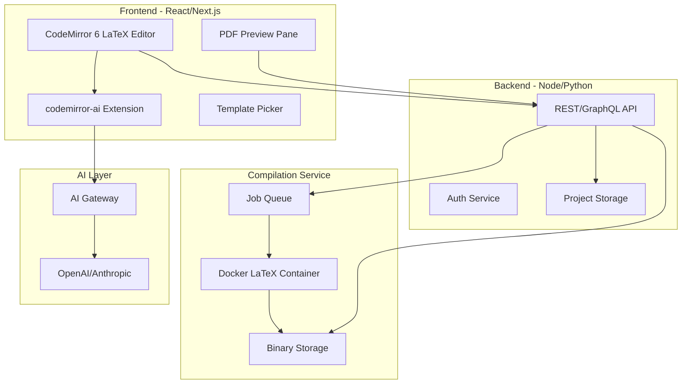

# LaTeX AI Editor - Cursor for LaTeX/Resumes

## Project Vision

An OverLeaf competitor focused on:

1. **AI-native editing** - Inline AI changes (select text, describe change, accept/reject) like Cursor
2. **Resume templates** - Curated, starting small, expanding over time
3. **Simplified UX** - Targeting resume/CV use case first, general LaTeX second

---

## Architecture Overview




---

## Tech Stack


| Layer                 | Technology                                         | Rationale                                                                                   |
| --------------------- | -------------------------------------------------- | ------------------------------------------------------------------------------------------- |
| **Frontend**          | Next.js 14 (App Router), React 18, TypeScript      | SSR, API routes, fast iteration                                                             |
| **Editor**            | CodeMirror 6 + `codemirror-lang-latex`             | Lightweight (~21KB vs Monaco 72MB), mature LaTeX support (syntax, autocomplete, hover docs) |
| **AI Inline Edits**   | `@marimo-team/codemirror-ai`                       | Built-in aiExtension, nextEditPrediction, accept/reject UI - "like Cursor"                  |
| **LaTeX Compilation** | Docker + `pdflatex` (Alpine TeX Live image ~200MB) | Full package support, sandboxed, proven (OverLeaf CLSI pattern)                             |
| **Backend**           | Next.js API Routes + tRPC or REST                  | Colocated, type-safe APIs                                                                   |
| **Database**          | PostgreSQL + Drizzle ORM                           | Projects, users, templates metadata                                                         |
| **File Storage**      | S3-compatible (R2/MinIO/Local)                     | Source files, compiled PDFs, images                                                         |
| **Queue**             | Inngest or BullMQ + Redis                          | Compile job queue, rate limiting                                                            |
| **Auth**              | Clerk                                              | SaaS-optimized, OAuth + email, user management UI included                                  |
| **Billing**           | Stripe                                             | Subscriptions, checkout, webhooks, customer portal                                          |
| **AI Provider**       | Google Gemini                                      | Streaming completions for inline edits                                                      |


---

## Key Technical Decisions

### 1. CodeMirror 6 over Monaco

- **CodeMirror**: 21KB gzipped, `codemirror-lang-latex` has LaTeX syntax, autocomplete, hover docs, auto-close environments. Replit bet on CodeMirror for similar use case.
- **Monaco**: 72MB+, no native LaTeX support, heavier customization.
- **Optional**: `codemirror-latex-visual` for WYSIWYG math/section widgets (Phase 3).

### 2. Server-Side Compilation over WASM

- **texlive.js (WASM)**: ~40MB download, limited packages, no `moderncv`, `resumacv`, etc. Suitable only for minimal docs.
- **Server-side Docker**: Full TeX Live, any package, sandboxed. Use `kjarosh/latex-docker` or custom Alpine + TeX Live (minimal scheme ~200MB).
- **Security**: Run `pdflatex` in ephemeral container, non-root user, no network, tmpfs for compile dir. OverLeaf CLSI pattern.

### 3. Inline AI Implementation

- Use `@marimo-team/codemirror-ai`:
  - **aiExtension**: User selects text, Cmd+K, types prompt, streams replacement. Accept (Cmd+Y) / Reject (Cmd+U).
  - **nextEditPrediction**: Optional "next edit" autocomplete (Tab to accept).
- **Prompt template**: Include `selection`, `codeBefore`, `codeAfter`, plus LaTeX-specific instructions (preserve structure, valid commands).
- **Streaming**: Call OpenAI/Anthropic with streaming; codemirror-ai handles incremental display.

### 4. Resume Templates

- Store templates as: `template_id/` folder with `main.tex`, `style.sty`, assets, `manifest.json` (name, variables, preview image).
- **Variables**: e.g. `{{name}}`, `{{email}}` - replace on "Use template" or via AI.
- Start with 3-5 templates: Modern CV, Academic, Minimalist, Creative (e.g. `moderncv`, `resumacv`, custom).

---

## Phased Implementation Plan

### Phase 1: Foundation (Weeks 1-3)

**Goal**: Minimal viable editor + compile + PDF preview.

- **1.1** Next.js project, TypeScript, Tailwind, basic layout (editor left, preview right).
- **1.2** CodeMirror 6 + `codemirror-lang-latex` integration. Load/save document state.
- **1.3** Compilation service: Docker image with `pdflatex`, REST endpoint that accepts LaTeX string, returns PDF URL or error log. Use job queue (e.g. Inngest) for async compiles.
- **1.4** PDF preview: iframe or `react-pdf` to display compiled PDF. Poll or WebSocket for compile completion.
- **1.5** Persistence: Save projects to DB (PostgreSQL) and source files to object storage. No auth initially (anonymous projects).

**Deliverable**: Type LaTeX, click Compile, see PDF. Save/load project.

---

### Phase 2: AI Inline Edits (Weeks 4-5)

**Goal**: Cursor-like inline AI changes.

- **2.1** Add `@marimo-team/codemirror-ai` aiExtension. Wire `prompt` to backend AI proxy.
- **2.2** Backend: `/api/ai/edit` - accepts `{ selection, codeBefore, codeAfter, userPrompt }`, streams completion from OpenAI/Anthropic. Enforce rate limits.
- **2.3** LaTeX-aware system prompt: "You are editing LaTeX. Return only the replacement text. Preserve document structure. Use valid LaTeX commands."
- **2.4** Keyboard shortcuts: Cmd+K to trigger, Cmd+Y accept, Cmd+U reject. Optional: nextEditPrediction for "next token" style completions.
- **2.5** Error handling: show error toast, allow retry.

**Deliverable**: Select LaTeX, Cmd+K, "change font to sans-serif", accept inline change.

---

### Phase 3: Resume Templates (Weeks 6-7)

**Goal**: Template gallery + one-click start.

- **3.1** Template data model: `templates` table + file structure in storage. `manifest.json`: name, description, variables, preview_image.
- **3.2** Template picker UI: grid of 3-5 templates with preview. "Use template" copies files into new project, replaces variables.
- **3.3** Variable substitution: parse `{{var}}` in templates, show form or inline edit for name, email, phone, etc.
- **3.4** Create initial templates: Modern CV, Academic, Minimalist (source from `moderncv`, `altacv`, or custom).

**Deliverable**: Browse templates, pick one, customize variables, edit in editor, compile.

---

### Phase 4: Auth, Projects, Billing (Weeks 8-10)

**Goal**: User accounts, project management, subscription billing.

- **4.1** Auth: Clerk integration. OAuth (Google, GitHub) + email/password. Middleware for protected routes.
- **4.2** Projects: list, create, rename, delete, duplicate. Associate with user.
- **4.3** Usage tracking: `user_usage` table, daily counters for compiles/AI calls, check limits in middleware.
- **4.4** Billing: Stripe Checkout for upgrades, webhooks for subscription events, customer portal link.
- **4.5** Share links: Optional read-only share link for projects (no edit collaboration).

**Deliverable**: Sign up, create projects, see usage, upgrade to paid, share read-only links.

---

### Phase 5: Polish and Scale (Weeks 11-12+)

**Goal**: Performance, UX, template expansion.

- **5.1** Incremental compile: only recompile on save or debounced (like OverLeaf). Cache compiles by content hash.
- **5.2** Compile queue: priority for paying users, fair queue for free tier.
- **5.3** More templates: 10-15 templates, categories (Resume, Cover Letter, Academic).
- **5.4** Export: PDF download, optionally LaTeX zip.
- **5.5** Mobile responsiveness: editor works on tablet (CodeMirror has mobile support).

---

## File Structure (Proposed)

```
latex-ai-editor/
├── src/
│   ├── app/                    # Next.js App Router
│   │   ├── (auth)/             # Auth routes
│   │   ├── (dashboard)/        # Editor, projects
│   │   │   ├── project/[id]/
│   │   │   └── templates/
│   │   └── api/
│   │       ├── compile/
│   │       ├── ai/
│   │       └── projects/
│   ├── components/
│   │   ├── editor/             # CodeMirror wrapper, AI extension
│   │   ├── preview/            # PDF viewer
│   │   └── templates/          # Template picker
│   ├── lib/
│   │   ├── compile/            # Compile service client, Docker logic
│   │   ├── ai/                 # AI proxy, prompt templates
│   │   └── db/                 # Drizzle schema, queries
│   └── templates/              # Built-in template definitions
├── compile-service/            # Optional: separate compile microservice
│   ├── Dockerfile
│   └── src/
├── docker/                     # LaTeX compilation image
│   └── Dockerfile.texlive
└── package.json
```

---

## Risk Mitigation


| Risk                            | Mitigation                                                                          |
| ------------------------------- | ----------------------------------------------------------------------------------- |
| LaTeX security (arbitrary code) | Ephemeral Docker container, no network, resource limits, timeout (60s)              |
| AI costs                        | Rate limits, token limits per request, consider caching repeated prompts            |
| Compile latency                 | Debounced compile, show "compiling..." immediately, consider incremental if complex |
| Package support                 | Use TeX Live full or medium scheme; add packages to Docker image as needed          |


---

## Design & Coding Standards

A comprehensive coding standards document has been created at:

**[.cursor/rules/CODING_STANDARDS.md](../.cursor/rules/CODING_STANDARDS.md)**

This document covers:

- **UI/Design System**: shadcn/ui components, Tailwind conventions, color palette, dark mode, layout patterns
- **TypeScript**: Strict mode, type definitions, Zod validation, naming conventions
- **React Patterns**: Component structure, state management (TanStack Query, Zustand), custom hooks, composition
- **Backend Architecture**: Service layer pattern, repository pattern, dependency injection
- **API Design**: REST conventions, response format, streaming for AI
- **Database**: Drizzle schema, migrations
- **Error Handling**: Custom error classes, error boundaries, toast notifications
- **Testing**: Unit (Vitest), component (Testing Library), E2E (Playwright)
- **Performance**: Code splitting, memoization, debouncing
- **Git Conventions**: Commit messages, branch naming

All code in this project should follow these standards for consistency.

---

## Key Decisions (Confirmed)

1. **Monetization**: Freemium model - free tier with limits, paid per user for higher limits
2. **Collaboration**: No real-time collaboration for v1
3. **Deployment**: SaaS only - all infrastructure provided by us

---

## Monetization & Limits Design

### Free Tier Limits

- **Compiles**: 50/day
- **AI edits**: 20/day  
- **Projects**: 3 max
- **Storage**: 50MB total

### Paid Tier (Per User/Month)

- **Compiles**: Unlimited (fair use)
- **AI edits**: 500/day
- **Projects**: Unlimited
- **Storage**: 1GB
- **Priority compile queue**

### Implementation

- Track usage in `user_usage` table (daily resets via cron)
- Middleware checks limits before compile/AI endpoints
- Use **Stripe** for subscriptions (checkout, webhooks, customer portal)
- Show usage dashboard in account settings

